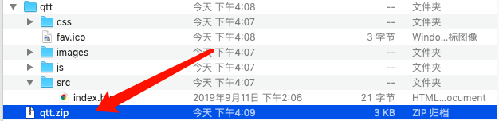

# 游戏中心版本和灰度控制

游戏在做版本迭代的时候往往不确定此次更新效果是否是正向的，游戏中心提供灰度版本的能力。开通此权限请先**咨询运营**。开通后会在游戏中心[开放平台](http://newidea4-gamecenter-frontend.1sapp.com/open-cms-new/prod/index.html#/login)游戏列表右侧多一个**去灰度**的按钮。

## 提交方式

### （一）上传前端资源

选择**游戏资源**后上传游戏前端资源压缩包（必须是 ZIP 格式）。

上传示例：

上传成功后需要按照压缩包里面的路径补充访问入口（本案例是：*qtt/src/index.html*），便形成了一个完整的游戏访问链接（本案例：[http://game-cdn.1sapp.com/game-pkg/game-a3Hb1fVbeq2w-1568535262/qtt/src/index.html](http://game-cdn.1sapp.com/game-pkg/game-a3Hb1fVbeq2w-1568535262/qtt/src/index.html)），可通过【访问】按钮测试。

（注意：因为新版的链接是游戏中心的链接，游戏后端需要设置跨域。）

### （二）提交新版本游戏链接

选择**链接**后填写新版本游戏链接，确保老游戏链接也能正常访问。

## 提交完成

提交成功后再列表左边能看到当前灰度状态，并且左边多出一个按钮可以查看灰度链接，注意：目前一个游戏同一时间只能提交一个版本灰度，只有等此次版本灰度结束以后才能提交新的版本灰度。

（感谢使用）
